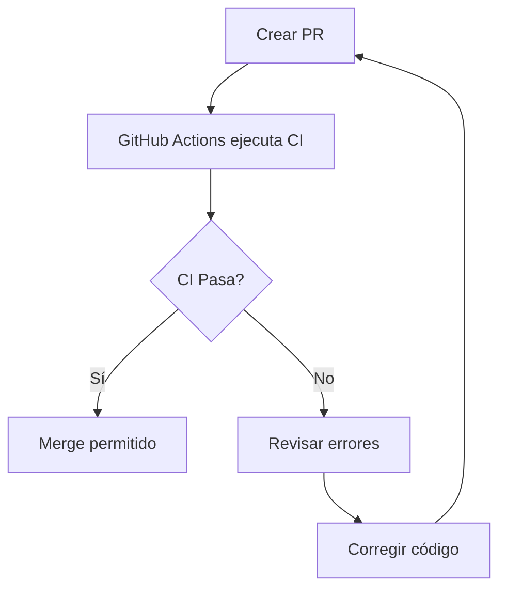

# CI/CD - Configuración GitHub Actions

## Descripción

El sistema de CI/CD ejecuta automáticamente checks de calidad en cada push a `main` y en todos los Pull Requests.

**Filosofía**: CI mínimo pero efectivo. No sobre-ingenierizar.

## Workflows Configurados

### 1. CI (`ci.yml`)

**Trigger**: Push a `main` + Pull Requests

**Jobs**:
1. ✅ **Lint** - ESLint para verificar calidad de código
2. ✅ **Test** - Suite de tests (auth, cifrado, APIs, cálculos)
3. ✅ **Build** - Compilación de producción con TypeScript check

**Duración estimada**: ~3-5 minutos

**Timeout**: 15 minutos (evita jobs colgados)

### 2. Cron Jobs

- `cron-clasificar-fichajes.yml` - Clasificar fichajes automáticamente
- `cron-revisar-solicitudes.yml` - Revisar solicitudes pendientes

## Secrets Necesarios

### GitHub Secrets (Repository Settings > Secrets and variables > Actions)

```bash
# Base de datos
DATABASE_URL                # PostgreSQL connection string

# Autenticación
NEXTAUTH_SECRET            # NextAuth secret key (min 32 chars)
ENCRYPTION_KEY             # AES-256 encryption key (64 hex chars)

# AWS Cognito
AWS_COGNITO_USER_POOL_ID   # Cognito User Pool ID
AWS_COGNITO_CLIENT_ID      # Cognito Client ID

# AWS S3
AWS_ACCESS_KEY_ID          # AWS access key
AWS_SECRET_ACCESS_KEY      # AWS secret key
AWS_S3_BUCKET              # S3 bucket name
AWS_REGION                 # AWS region (eu-west-1)

# Redis (opcional)
REDIS_URL                  # Redis connection string

# Email
RESEND_API_KEY             # Resend API key

# OpenAI (opcional)
OPENAI_API_KEY             # OpenAI API key
```

## Flujo de Trabajo

### 1. Desarrollo Local

```bash
# Antes de hacer commit
npm run lint              # Verificar código
npm run test              # Ejecutar tests
npm run build             # Verificar que compila
```

### 2. Pull Request



**Checks automáticos**:
- ✅ Linter sin errores
- ✅ Todos los tests pasan
- ✅ Build exitoso

**Merge bloqueado** si algún check falla.

### 3. Merge a Main

```bash
# Después del merge a main
1. CI ejecuta todos los checks
2. Si pasa, el código está listo para deploy
3. Deploy manual a staging/producción
```

## Estrategia de Despliegue

### NO Automatizado (Intencionalmente)

**Por qué no CD automático**:
- MVP en fase temprana
- Despliegues requieren verificación manual
- Evita despliegues accidentales
- Control total sobre cuándo y qué se despliega

### Despliegue Manual

```bash
# Staging
ssh clousadmin-staging
cd /var/www/clousadmin
git pull origin main
npm ci
npm run build
pm2 restart clousadmin

# Producción (requiere aprobación)
ssh clousadmin-production
cd /var/www/clousadmin
git pull origin main
npm ci
npm run build
pm2 restart clousadmin
```

Ver `docs/DEPLOY_HETZNER.md` para más detalles.

## Troubleshooting

### CI falla en "Instalar dependencias"

**Síntoma**: `npm ci` falla

**Causa**: `package-lock.json` desactualizado

**Solución**:
```bash
npm install
git add package-lock.json
git commit -m "chore: actualizar package-lock.json"
git push
```

### CI falla en "Generar Prisma Client"

**Síntoma**: `npm run db:generate` falla

**Causa**: Error en `schema.prisma`

**Solución**: Verificar schema localmente:
```bash
npx prisma validate
npx prisma generate
```

### CI falla en "Ejecutar linter"

**Síntoma**: ESLint reporta errores

**Solución**: Ejecutar localmente y corregir:
```bash
npm run lint
```

### CI falla en "Ejecutar tests"

**Síntoma**: Tests fallan en CI pero pasan localmente

**Causas comunes**:
1. Tests dependen de estado local (archivos, DB)
2. Tests no son determinísticos (usan `Date.now()`, random)
3. Variables de entorno incorrectas

**Solución**: Asegurar que tests son independientes:
```typescript
// ❌ MAL - Depende de estado
const data = fs.readFileSync('temp-file.txt');

// ✅ BIEN - Independiente
const data = 'mock data';
```

### CI falla en "Build producción"

**Síntoma**: `npm run build` falla

**Causas comunes**:
1. Errores de TypeScript
2. Imports incorrectos
3. Variables de entorno faltantes

**Solución**: Build local primero:
```bash
npm run build
# Revisar errores reportados
```

### CI muy lento

**Síntoma**: CI tarda >10 minutos

**Causas**:
1. `npm ci` tarda mucho (caché no funciona)
2. Build muy pesado

**Solución**: 
- Verificar que caché de npm funciona
- Considerar optimizar build (reducir dependencias)

## Métricas

### Objetivos

- ⏱️ **Duración**: < 5 minutos
- ✅ **Success Rate**: > 95%
- 🔄 **Frequency**: Múltiples veces al día

### Monitoreo

Ver en GitHub: `Actions` tab

- Total runs
- Success/failure rate
- Average duration
- Most failed jobs

## Mejoras Futuras

### Fase 2

- [ ] Añadir cobertura de tests (cuando haya más tests)
- [ ] Notificaciones Slack/Discord en fallos
- [ ] Deploy automático a staging (después de validación)
- [ ] Preview deployments para PRs (Vercel/Netlify)

### Fase 3

- [ ] E2E tests automatizados (Playwright)
- [ ] Performance tests (Lighthouse CI)
- [ ] Security scanning (Snyk/Dependabot)
- [ ] Deploy automático a producción (con smoke tests post-deploy)

## Referencias

- [GitHub Actions Docs](https://docs.github.com/en/actions)
- [Next.js CI Examples](https://nextjs.org/docs/app/building-your-application/deploying/ci-build-caching)
- [Prisma CI Setup](https://www.prisma.io/docs/guides/development-environment/environment-variables)

---

**Última actualización**: 2025-11-17
**Responsable**: Equipo de desarrollo


