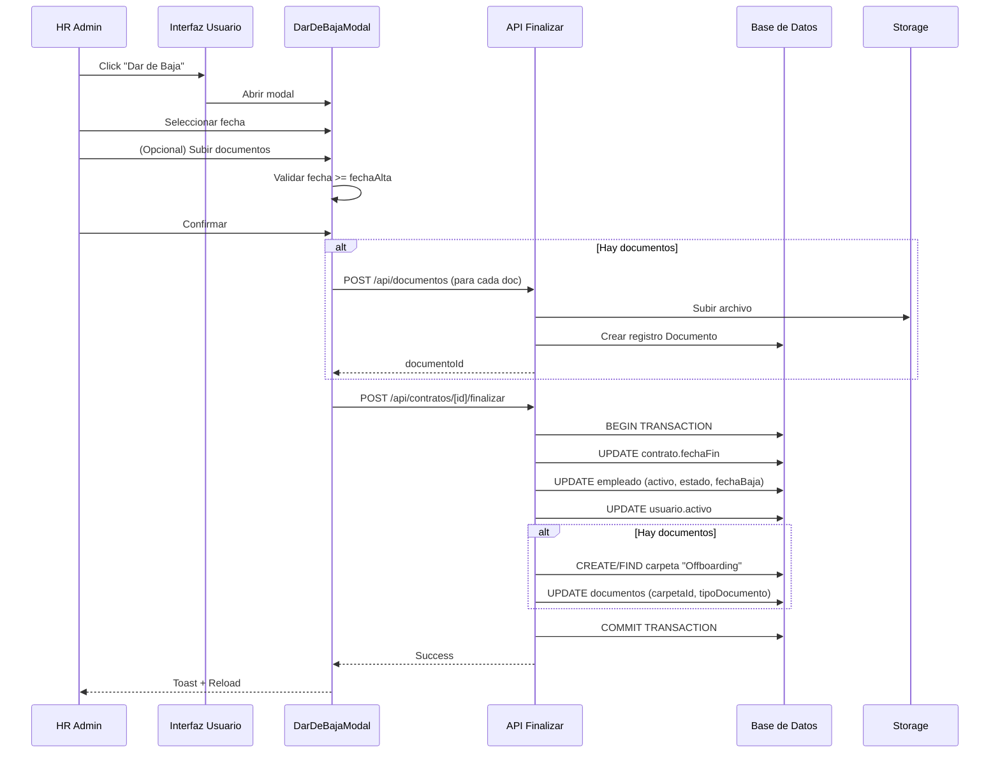

# Offboarding / Dar de Baja de Empleados

## Índice
1. [Descripción General](#descripción-general)
2. [Flujo del Proceso](#flujo-del-proceso)
3. [Componentes Implicados](#componentes-implicados)
4. [Base de Datos](#base-de-datos)
5. [API Endpoints](#api-endpoints)
6. [Interfaz de Usuario](#interfaz-de-usuario)
7. [Seguridad y Permisos](#seguridad-y-permisos)
8. [Casos de Uso](#casos-de-uso)
9. [Mantenimiento y Troubleshooting](#mantenimiento-y-troubleshooting)

---

## Descripción General

El proceso de **Offboarding** o **Dar de Baja** permite a los administradores de RRHH finalizar la relación laboral de un empleado con la empresa de forma ordenada y documentada.

### Características Principales

- ✅ Selección de fecha de finalización personalizada
- ✅ Upload opcional de documentos de offboarding
- ✅ Validación de fechas (no anterior al inicio del contrato)
- ✅ Desactivación automática del acceso del empleado
- ✅ Preservación de datos históricos (no se elimina información)
- ✅ Carpeta específica para documentos de offboarding
- ✅ Proceso transaccional (todo o nada)

### Acciones Realizadas

Cuando se da de baja a un empleado, el sistema realiza automáticamente las siguientes acciones:

1. **Contrato**: Se establece la `fechaFin` con la fecha especificada
2. **Empleado**: 
   - `activo` → `false`
   - `estadoEmpleado` → `'baja'`
   - `fechaBaja` → fecha especificada
3. **Usuario**: `activo` → `false` (deshabilita acceso inmediato)
4. **Documentos**: Se guardan en carpeta "Offboarding" si se subieron

---

## Flujo del Proceso



---

## Componentes Implicados

### 1. Modelo de Datos (Prisma Schema)

#### Empleado
```prisma
model Empleado {
  activo         Boolean  @default(true)
  fechaBaja      DateTime?
  estadoEmpleado String   @default("activo") // 'activo', 'baja', 'suspendido'
  // ... otros campos
}
```

#### Usuario
```prisma
model Usuario {
  activo Boolean @default(true)
  // ... otros campos
}
```

#### Contrato
```prisma
model Contrato {
  fechaInicio DateTime  @db.Date
  fechaFin    DateTime? @db.Date
  // ... otros campos
}
```

#### Documento
```prisma
model Documento {
  tipoDocumento String // puede ser 'offboarding'
  carpetaId     String?
  // ... otros campos
}
```

#### Carpeta
```prisma
model Carpeta {
  nombre    String
  esSistema Boolean @default(false) // true para "Offboarding"
  // ... otros campos
}
```

### 2. API Endpoint

**Archivo**: `/app/api/contratos/[id]/finalizar/route.ts`

#### Request

```typescript
POST /api/contratos/[contratoId]/finalizar

Headers:
  Content-Type: application/json
  
Body:
{
  "fechaFin": "2025-12-31",           // Required - Fecha ISO format
  "motivo": "string",                  // Optional
  "documentosIds": ["doc1", "doc2"]   // Optional - IDs de docs ya subidos
}
```

#### Response (Success)

```typescript
{
  "success": true,
  "message": "Empleado dado de baja correctamente",
  "data": {
    "contratoId": "uuid",
    "empleadoId": "uuid",
    "usuarioId": "uuid",
    "fechaFinalizacion": "2025-12-31T00:00:00.000Z",
    "documentosProcesados": 2
  }
}
```

#### Response (Error)

```typescript
{
  "error": "Datos inválidos",
  "details": [...]
}
```

#### Validaciones

- ✅ Usuario autenticado y rol `hr_admin`
- ✅ Contrato existe y pertenece a la empresa del HR admin
- ✅ Fecha de finalización no es anterior a `fechaInicio` del contrato
- ✅ Fecha de finalización es una fecha válida

### 3. Componente UI

**Archivo**: `/components/hr/DarDeBajaModal.tsx`

#### Props

```typescript
interface DarDeBajaModalProps {
  open: boolean;
  onOpenChange: (open: boolean) => void;
  empleado: {
    id: string;
    nombre: string;
    apellidos: string;
    fechaAlta: string;
  };
  contratoId: string;
  onSuccess?: () => void;
}
```

#### Características

- Input de fecha con validación (min: fechaAlta del empleado)
- Drag & drop o selector de archivos (múltiples)
- Validación de tamaño (máx. 20MB total)
- Tipos permitidos: PDF, DOC, DOCX, JPG, PNG
- Lista visual de archivos seleccionados
- Loading states durante upload y proceso
- Feedback claro de acciones que se realizarán

---

## Base de Datos

### Tablas Afectadas

1. **contratos**
   - Campo actualizado: `fechaFin`
   
2. **empleados**
   - Campos actualizados: `activo`, `estadoEmpleado`, `fechaBaja`
   
3. **usuarios**
   - Campo actualizado: `activo`
   
4. **carpetas** (si no existe carpeta "Offboarding")
   - Nueva carpeta creada con `esSistema: true`
   
5. **documentos** (si se subieron documentos)
   - Campos actualizados: `carpetaId`, `tipoDocumento`

### Transacción

Todo el proceso se ejecuta en una **transacción de Prisma** para garantizar consistencia:

```typescript
await prisma.$transaction(async (tx) => {
  // 1. UPDATE contrato
  // 2. UPDATE empleado
  // 3. UPDATE usuario
  // 4. CREATE/FIND carpeta Offboarding (si hay docs)
  // 5. UPDATE documentos (si hay docs)
});
```

Si cualquier paso falla, se hace **rollback** automático de todos los cambios.

---

## API Endpoints

### Documentos

Para subir documentos de offboarding, el modal utiliza:

```typescript
POST /api/documentos

FormData:
  - file: File
  - carpetaId: string
  - tipoDocumento: 'offboarding'
  - empleadoId: string
```

### Carpetas

Para buscar o crear la carpeta "Offboarding":

```typescript
GET /api/carpetas?empleadoId={id}&nombre=Offboarding

POST /api/carpetas
Body:
{
  "nombre": "Offboarding",
  "empleadoId": "uuid",
  "esSistema": true
}
```

---

## Interfaz de Usuario

### Ubicación

El botón "Dar de Baja" se encuentra en:

**Ruta**: `/hr/organizacion/personas/[id]` → Tab "Contratos"

### Estados del Botón

```typescript
// Habilitado: empleado activo con contrato
<Button variant="destructive" disabled={false}>
  Dar de Baja
</Button>

// Deshabilitado: empleado ya dado de baja
<Button variant="destructive" disabled={true}>
  Empleado dado de baja
</Button>

// Deshabilitado: sin contrato
<Button variant="destructive" disabled={true}>
  Dar de Baja
</Button>
```

### Modal

**Componente**: `<DarDeBajaModal />`

#### Campos

1. **Fecha de Finalización** (obligatorio)
   - Input type="date"
   - Min: `fechaAlta` del empleado
   - Max: 1 año en el futuro
   - Default: hoy

2. **Documentos de Offboarding** (opcional)
   - Multiple file upload
   - Drag & drop o click
   - Preview de archivos seleccionados
   - Botón para remover archivos

#### Advertencias

El modal muestra claramente las acciones que se realizarán:

- ✅ Finalizará el contrato con la fecha especificada
- ✅ Cambiará el estado del empleado a "Baja"
- ✅ Desactivará el acceso a la plataforma inmediatamente
- ✅ Los datos del empleado se mantendrán en el sistema (archivados)
- ✅ Se guardarán N documento(s) en la carpeta "Offboarding"

---

## Seguridad y Permisos

### Control de Acceso

- **Rol requerido**: `hr_admin`
- **Verificación**: El contrato debe pertenecer a la misma empresa que el HR admin
- **Middleware**: `requireAuthAsHR()` en la API

### Auditoría

Se registra en logs:

```typescript
console.info('[Offboarding] Empleado dado de baja:', {
  empleadoId: string,
  contratoId: string,
  fechaFin: Date,
  documentos: number,
  hrAdminId: string,
});
```

### Reversibilidad

⚠️ **IMPORTANTE**: La acción NO es reversible desde la UI.

Para reactivar un empleado, un administrador debe:
1. Actualizar manualmente en la base de datos
2. O crear un nuevo contrato

---

## Casos de Uso

### Caso 1: Baja por Finalización de Contrato Temporal

**Contexto**: Empleado con contrato temporal que llega a su fin.

**Pasos**:
1. HR admin accede al perfil del empleado
2. Click en "Dar de Baja"
3. Selecciona la fecha de fin del contrato
4. (Opcional) Sube certificado de trabajo, finiquito
5. Confirma la acción
6. El sistema desactiva el empleado y guarda los documentos

**Resultado**:
- Empleado pasa a estado "Baja"
- Usuario pierde acceso inmediato
- Documentos guardados en carpeta "Offboarding"

### Caso 2: Despido con Documentación Legal

**Contexto**: Despido con causa que requiere documentación legal.

**Pasos**:
1. HR admin accede al perfil del empleado
2. Click en "Dar de Baja"
3. Selecciona la fecha efectiva de despido
4. Sube carta de despido, acta, finiquito
5. Confirma la acción

**Resultado**:
- Empleado desactivado inmediatamente
- Documentación legal archivada
- Acceso revocado

### Caso 3: Baja Voluntaria

**Contexto**: Empleado presenta renuncia voluntaria.

**Pasos**:
1. HR admin accede al perfil del empleado
2. Click en "Dar de Baja"
3. Selecciona la fecha de último día de trabajo
4. Sube carta de renuncia
5. Confirma la acción

**Resultado**:
- Empleado pasa a "Baja" en la fecha especificada
- Carta de renuncia archivada

---

## Mantenimiento y Troubleshooting

### Problemas Comunes

#### 1. Error: "Fecha de finalización no puede ser anterior"

**Causa**: La fecha seleccionada es anterior a `fechaAlta` del empleado.

**Solución**: Seleccionar una fecha igual o posterior a la fecha de alta.

#### 2. Error al subir documentos

**Causa**: Archivo muy grande o formato no permitido.

**Solución**: 
- Máximo 20MB total
- Formatos: PDF, DOC, DOCX, JPG, PNG

#### 3. Empleado no puede ser dado de baja

**Causa**: No existe contrato activo asociado.

**Solución**: Verificar que el empleado tenga un contrato registrado en el sistema.

#### 4. Transacción falla durante el proceso

**Causa**: Error en alguna de las actualizaciones de BD.

**Solución**: 
- Verificar logs del servidor
- Todas las operaciones hacen rollback automático
- Ningún dato queda en estado inconsistente

### Logs Importantes

```typescript
// Success
[Offboarding] Empleado dado de baja: { empleadoId, contratoId, fechaFin, documentos, hrAdminId }

// Errors
[API Error] /api/contratos/[id]/finalizar: { error details }
```

### Testing Manual

**Checklist**:
- [ ] HR admin puede abrir el modal
- [ ] Fecha de finalización se puede seleccionar
- [ ] Fecha anterior a fechaAlta está bloqueada
- [ ] Documentos se pueden subir (< 20MB)
- [ ] Preview de documentos funciona correctamente
- [ ] Documentos se pueden remover antes de confirmar
- [ ] Botón "Dar de Baja" muestra loading state
- [ ] Toast de éxito se muestra
- [ ] Página recarga tras éxito
- [ ] Empleado aparece como "Baja" tras reload
- [ ] Usuario no puede hacer login después
- [ ] Documentos aparecen en carpeta "Offboarding"

### Queries Útiles para Debugging

```sql
-- Ver estado de un empleado
SELECT id, nombre, apellidos, activo, estadoEmpleado, fechaBaja
FROM empleados
WHERE id = 'empleado-id';

-- Ver contrato del empleado
SELECT id, fechaInicio, fechaFin, tipoContrato
FROM contratos
WHERE empleadoId = 'empleado-id';

-- Ver usuario asociado
SELECT id, email, activo, rol
FROM usuarios
WHERE empleadoId = 'empleado-id';

-- Ver documentos de offboarding
SELECT d.id, d.nombre, d.tipoDocumento, c.nombre as carpeta
FROM documentos d
JOIN carpetas c ON d.carpetaId = c.id
WHERE c.nombre = 'Offboarding' AND c.empleadoId = 'empleado-id';
```

---

## Mejoras Futuras

### Fase 2

- [ ] Email automático al empleado notificando la baja
- [ ] Email a gestoría con datos de la baja
- [ ] Generación automática de documentos de finiquito
- [ ] Histórico de cambios (auditoría completa)
- [ ] Reactivación de empleados desde la UI
- [ ] Workflow de aprobación multi-nivel

### Fase 3

- [ ] Integración con sistemas externos (gestoría, SEPE)
- [ ] Exportación de datos para gestoría
- [ ] Dashboard de bajas del mes/año
- [ ] Análisis de rotación de empleados
- [ ] Checklist personalizable de offboarding

---

## Referencias

### Archivos Relacionados

- API: `/app/api/contratos/[id]/finalizar/route.ts`
- Modal: `/components/hr/DarDeBajaModal.tsx`
- UI Detail: `/app/(dashboard)/hr/organizacion/personas/[id]/empleado-detail-client.tsx`
- Schema: `/prisma/schema.prisma`
- Docs: `/docs/funcionalidades/offboarding.md` (este archivo)

### Documentación Relacionada

- [Contratos](./contratos.md)
- [Nóminas](./nominas.md)
- [Documentos](./documentos.md)
- [Gestión de Empleados](./empleados.md)

---

**Última actualización**: 2025-01-27
**Versión**: 1.0.0


