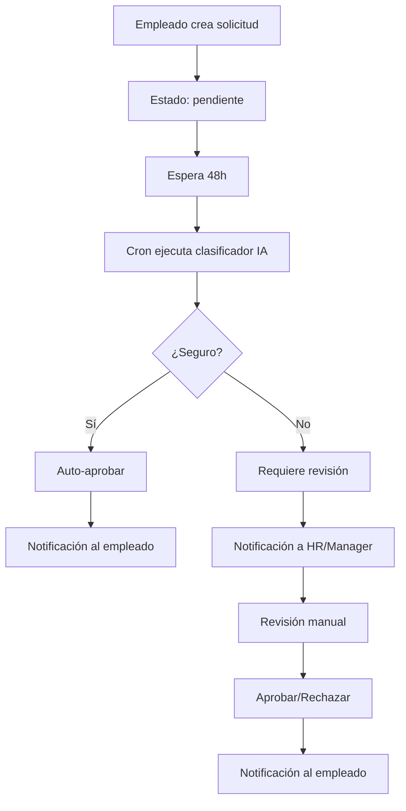
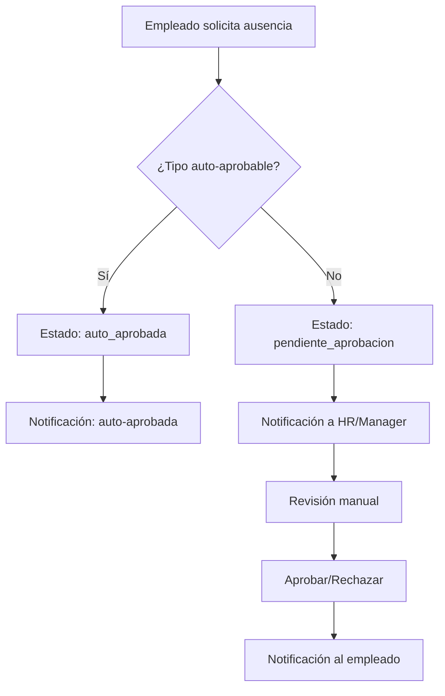
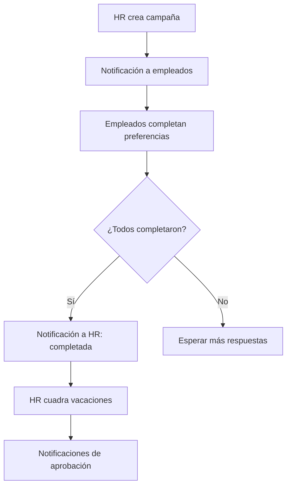

## 🎉 IMPLEMENTACIÓN COMPLETA - Sistema de Notificaciones y Solicitudes

### ✅ **Estado: COMPLETADO Y OPTIMIZADO**

Fecha: 8 de Noviembre, 2025

---

## 📦 Componentes Implementados

### 1. **Backend - Sistema Core**

#### Schema y Base de Datos
- ✅ `EstadoSolicitud` enum con 5 estados claros
- ✅ Campos IA en `SolicitudCambio`: `revisionIA`, `revisadaPorIA`, `requiereAprobacionManual`
- ✅ Migración aplicada: `20251108032428_add_estado_solicitud_enum`

#### Notificaciones Tipadas (`lib/notificaciones.ts`)
```typescript
// 8 nuevas funciones helper
crearNotificacionSolicitudAprobada(prisma, { ..., aprobadoPor: 'ia' | 'manual' })
crearNotificacionSolicitudRechazada(prisma, { ..., motivoRechazo })
crearNotificacionSolicitudRequiereRevision(prisma, { ... })
crearNotificacionAusenciaAutoAprobada(prisma, { ... })
crearNotificacionCampanaCreada(prisma, { ..., empleadosIds })
crearNotificacionCampanaCompletada(prisma, { ... })
crearNotificacionOnboardingCompletado(prisma, { ... })
crearNotificacionComplementosPendientes(prisma, { ..., requiresModal: true })
```

#### Clasificador IA (`lib/ia/clasificador-solicitudes.ts`)
```typescript
// Sigue Classification Pattern del core IA
const clasificacion = await clasificarSolicitud({
  id, tipo, camposCambiados, motivo, empleado
});

// Retorna:
{
  requiereRevisionManual: boolean,
  confianza: number,  // 0-100
  razonamiento: string
}
```

**Criterios de Clasificación:**
- ✅ **Auto**: Dirección, teléfono, email personal, 1 solo campo, motivo coherente
- ⚠️ **Manual**: IBAN, NIE/DNI/NIF, nombre/apellidos, ≥3 campos, datos sensibles

#### Cron Job (`app/api/cron/revisar-solicitudes/route.ts`)
```bash
# Ejecutar diariamente
curl -X POST https://yourapp.com/api/cron/revisar-solicitudes \
  -H "Authorization: Bearer $CRON_SECRET"
```

**Configuración:**
```bash
SOLICITUDES_PERIODO_REVISION_HORAS=48  # Default 48h
CRON_SECRET=tu-secret-aqui
```

#### Whitelist Centralizada (`lib/constants/whitelist-campos.ts`)
```typescript
export const CAMPOS_EMPLEADO_PERMITIDOS = [
  'nombre', 'apellidos', 'telefono', 'telefonoEmergencia',
  'direccionCalle', 'direccionNumero', 'direccionPiso',
  'codigoPostal', 'ciudad', 'direccionProvincia',
  'emailPersonal', 'contactoEmergenciaNombre',
  'contactoEmergenciaRelacion', 'contactoEmergenciaTelefono',
  'iban'
] as const;

export function esCampoPermitido(campo: string): boolean;
```

---

### 2. **Frontend - React Query & Hooks**

#### Provider Setup (`app/providers.tsx`)
```typescript
// Ya integrado en app/layout.tsx
<Providers>
  {children}
  <Toaster />
</Providers>
```

#### Hooks Disponibles

**Notificaciones** (`lib/hooks/useNotificaciones.ts`):
```typescript
const { data: notifs, isLoading } = useNotificaciones({ leida: false });
const { data: count } = useNotificacionesNoLeidas(); // Refetch cada 30s
const { mutate: marcarLeida } = useMarcarLeida();
const { mutate: marcarTodas } = useMarcarTodasLeidas();
```

**Solicitudes** (`lib/hooks/useSolicitudes.ts`):
```typescript
const { data: solicitudes } = useSolicitudes('pendiente');
const { data: solicitud } = useSolicitud(id);
const { mutate: crear } = useCrearSolicitud();
const { mutate: accion } = useAccionSolicitud(id);
const { mutate: autoAprobar } = useAutoAprobarSolicitudes();
```

#### Componentes Optimizados

**Bandeja con React Query** (`components/hr/bandeja-entrada-tabs-optimized.tsx`):
```typescript
<BandejaEntradaTabsOptimized
  solicitudesPendientes={solicitudes}
  solicitudesResueltas={resueltas}
  solvedStats={stats}
  solvedItems={items}
  notificaciones={notificaciones}
/>
```

**Características:**
- ✅ Sin `window.location.reload()`
- ✅ Invalidación automática de queries
- ✅ Toast notifications con sonner
- ✅ Manejo de errores robusto

**Modal de Complementos** (`components/hr/modal-complementos-nomina.tsx`):
```typescript
<ModalComplementosNomina
  open={modalOpen}
  onOpenChange={setModalOpen}
  nominaId={nominaId}
  mes={mes}
  año={año}
  empleados={equipo}
  onGuardado={() => {
    queryClient.invalidateQueries({ queryKey: ['notificaciones'] });
  }}
/>
```

---

## 🚀 Guía de Uso

### Para Desarrolladores

#### 1. Crear Nueva Notificación

```typescript
// 1. Definir tipo en lib/notificaciones.ts
export type TipoNotificacion = 
  | ... 
  | 'mi_nuevo_tipo';

// 2. Crear función helper
export async function crearNotificacionMiTipo(
  prisma: PrismaClient,
  params: { ... }
) {
  await crearNotificaciones(prisma, {
    empresaId,
    usuarioIds: await obtenerUsuariosANotificar(prisma, empresaId, {
      hrAdmin: true,
      manager: managerId,
      empleado: empleadoId,
    }),
    tipo: 'mi_nuevo_tipo',
    titulo: 'Título',
    mensaje: 'Mensaje descriptivo',
    metadata: {
      // Datos contextuales
      prioridad: 'alta',
      accionUrl: '/ruta/accion',
      accionTexto: 'Ver detalles',
    },
  });
}

// 3. Usar en tu API/lógica
await crearNotificacionMiTipo(prisma, { ... });
```

#### 2. Agregar Campo a Whitelist

```typescript
// lib/constants/whitelist-campos.ts
export const CAMPOS_EMPLEADO_PERMITIDOS = [
  ...
  'nuevoCampo',  // ← Agregar aquí
] as const;

// TypeScript automáticamente actualiza el tipo
```

#### 3. Usar Hooks en Componentes

```typescript
'use client';

import { useNotificaciones, useMarcarLeida } from '@/lib/hooks/useNotificaciones';

export function MiComponente() {
  const { data, isLoading, refetch } = useNotificaciones({ leida: false });
  const { mutate: marcar } = useMarcarLeida();

  const handleClick = (id: string) => {
    marcar(id, {
      onSuccess: () => {
        // Query se invalida automáticamente
        console.log('Marcada como leída');
      }
    });
  };

  if (isLoading) return <div>Cargando...</div>;

  return (
    <div>
      {data?.map(notif => (
        <div key={notif.id} onClick={() => handleClick(notif.id)}>
          {notif.titulo}
        </div>
      ))}
    </div>
  );
}
```

#### 4. Implementar Optimistic Updates

```typescript
const { mutate } = useAccionSolicitud(id);

const handleAprobar = () => {
  mutate({ accion: 'aprobar' }, {
    // Optimistic update
    onMutate: async () => {
      // Cancelar queries en progreso
      await queryClient.cancelQueries({ queryKey: ['solicitudes'] });
      
      // Snapshot del estado actual
      const prevData = queryClient.getQueryData(['solicitudes']);
      
      // Actualizar optimísticamente
      queryClient.setQueryData(['solicitudes'], (old: any) => {
        return old.map((s: any) => 
          s.id === id ? { ...s, estado: 'aprobada_manual' } : s
        );
      });
      
      return { prevData };
    },
    
    // Si falla, revertir
    onError: (err, variables, context) => {
      queryClient.setQueryData(['solicitudes'], context.prevData);
    },
    
    // Siempre refetch para sincronizar
    onSettled: () => {
      queryClient.invalidateQueries({ queryKey: ['solicitudes'] });
    }
  });
};
```

---

## 📊 Flujos Implementados

### Flujo 1: Solicitud de Cambio de Datos



### Flujo 2: Ausencia por Enfermedad



### Flujo 3: Campaña de Vacaciones



---

## 🧪 Testing

### Unit Tests (Sugerido)

```typescript
// __tests__/clasificador-solicitudes.test.ts
describe('Clasificador de Solicitudes', () => {
  it('debe auto-aprobar cambio de dirección', async () => {
    const result = await clasificarSolicitud({
      id: '1',
      tipo: 'cambio_datos',
      camposCambiados: { direccionCalle: 'Nueva calle' },
      motivo: 'Mudanza',
      empleado: { nombre: 'Juan', apellidos: 'García' }
    });
    
    expect(result.requiereRevisionManual).toBe(false);
    expect(result.confianza).toBeGreaterThan(75);
  });
  
  it('debe requerir revisión para cambio de IBAN', async () => {
    const result = await clasificarSolicitud({
      id: '2',
      tipo: 'cambio_datos',
      camposCambiados: { iban: 'ES12...' },
      motivo: 'Cambio de banco',
      empleado: { nombre: 'María', apellidos: 'López' }
    });
    
    expect(result.requiereRevisionManual).toBe(true);
  });
});
```

### Integration Tests (Sugerido)

```typescript
// __tests__/flujo-solicitudes.test.ts
describe('Flujo Completo de Solicitudes', () => {
  it('debe crear, clasificar y aprobar solicitud', async () => {
    // 1. Crear solicitud
    const solicitud = await crearSolicitud({ ... });
    expect(solicitud.estado).toBe('pendiente');
    
    // 2. Clasificar con IA
    const clasificacion = await clasificarSolicitud(solicitud);
    
    // 3. Actualizar según clasificación
    if (!clasificacion.requiereRevisionManual) {
      await aprobarSolicitud(solicitud.id);
      expect(notificacionesEnviadas).toContain('solicitud_aprobada');
    }
  });
});
```

---

## 🔧 Troubleshooting

### Problema: Notificaciones no se crean

**Síntomas**: El flujo se ejecuta pero no aparecen notificaciones

**Solución**:
1. Verificar que el `usuarioId` existe y es válido
2. Revisar logs: `[Notificaciones] Creando notificación...`
3. Verificar que `obtenerUsuariosANotificar()` retorna IDs

```typescript
// Debug
const usuarioIds = await obtenerUsuariosANotificar(prisma, empresaId, {
  hrAdmin: true
});
console.log('Usuarios a notificar:', usuarioIds);
```

### Problema: Clasificador siempre requiere revisión

**Síntomas**: Todas las solicitudes van a revisión manual

**Solución**:
1. Verificar que hay API keys de IA configuradas
2. Revisar logs del clasificador
3. Verificar que el campo está en la whitelist

```bash
# Verificar IA disponible
OPENAI_API_KEY=xxx npm run dev
# Revisar logs
[Clasificador Solicitudes] {id} → MANUAL (85% confianza) usando openai
```

### Problema: React Query no actualiza UI

**Síntomas**: Los datos no se refrescan tras mutación

**Solución**:
1. Verificar que `queryClient.invalidateQueries()` se llama
2. Usar las mismas `queryKey` en queries y invalidaciones
3. Verificar que el componente está dentro de `<Providers>`

```typescript
// Correcto
queryClient.invalidateQueries({ queryKey: ['solicitudes'] });

// Incorrecto (key diferente)
useQuery({ queryKey: ['all-solicitudes'] });
queryClient.invalidateQueries({ queryKey: ['solicitudes'] });
```

---

## 📈 Métricas y Monitoreo

### Logs Importantes

```bash
# Clasificador IA
[Clasificador Solicitudes] {id} → AUTO-APROBABLE (85% confianza) usando openai
[Clasificador Solicitudes] Razonamiento: ...

# Cron Job
[CRON Revisar Solicitudes] 15 solicitudes a revisar
[CRON Revisar Solicitudes] Clasificación: AUTO (confianza: 90%)
[CRON Revisar Solicitudes] Proceso completado: {"autoAprobadas": 12, "requierenRevision": 3}

# Notificaciones
[Notificaciones] Creando notificación solicitud_aprobada para empleado {id}
[Notificaciones] 2 notificaciones creadas para 2 usuarios
```

### Dashboard Sugerido

**Métricas clave a trackear:**
1. % de solicitudes auto-aprobadas vs manual
2. Tiempo promedio de revisión
3. Confianza promedio del clasificador IA
4. Tasa de error del clasificador (false positives/negatives)
5. Volumen de notificaciones por tipo

---

## 🎓 Best Practices

### 1. Notificaciones
- ✅ Usar funciones helper tipadas (no crear notificaciones manualmente)
- ✅ Incluir metadata rica para contexto
- ✅ Priorizar correctamente (normal, alta, crítica)
- ✅ Proporcionar URLs de acción útiles

### 2. Clasificador IA
- ✅ Siempre tener fail-safe (defaultear a manual en errores)
- ✅ Loguear razonamiento para debugging
- ✅ Mantener criterios actualizados con negocio
- ✅ Monitorear confianza y ajustar threshold si es necesario

### 3. React Query
- ✅ Invalidar queries tras mutaciones
- ✅ Usar optimistic updates para UX instantánea
- ✅ Manejar estados de loading/error
- ✅ Configurar staleTime apropiado por tipo de dato

### 4. Whitelist
- ✅ Usar constante centralizada
- ✅ Documentar por qué cada campo está permitido
- ✅ Revisar periódicamente si hay campos faltantes
- ✅ Validar en backend (nunca confiar en frontend)

---

## ✅ Checklist de Producción

Antes de deploy:

- [ ] Variables de entorno configuradas (`CRON_SECRET`, API keys IA)
- [ ] Cron job programado en Vercel/plataforma
- [ ] Migración de Prisma aplicada en prod
- [ ] Tests unitarios pasando
- [ ] Tests de integración pasando
- [ ] Logs y monitoreo configurados
- [ ] Documentación actualizada
- [ ] Code review completado
- [ ] Testing manual del flujo completo

---

## 📞 Soporte

Para dudas o issues:
1. Revisar esta documentación
2. Revisar logs en consola
3. Verificar configuración de variables de entorno
4. Revisar [ARQUITECTURA_IA.md](./ia/ARQUITECTURA_IA.md) para temas de IA

**Documentos relacionados:**
- [IMPLEMENTACION_NOTIFICACIONES_SOLICITUDES.md](./IMPLEMENTACION_NOTIFICACIONES_SOLICITUDES.md)
- [ia/ARQUITECTURA_IA.md](./ia/ARQUITECTURA_IA.md)
- [ia/ENV_VARIABLES.md](./ia/ENV_VARIABLES.md)

---

**Estado**: ✅ PRODUCCIÓN READY  
**Versión**: 1.0.0  
**Última actualización**: 8 de Noviembre, 2025

